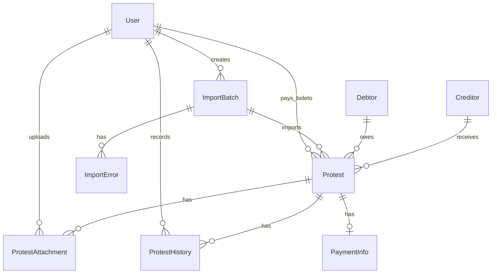

# Schema - Especificação Funcional

## 1. Visão Geral

O sistema controla protestos, pagamentos de clientes e boletos que precisam ser pagos pelo chefe. O objetivo é substituir controles manuais dispersos por um painel simples, com histórico e indicadores.

## 2. Atores

- Funcionário: importa protestos, acompanha casos, registra pagamento do cliente, informa boleto, registra pendências e observações.
- Chefe: visualiza boletos pendentes e marca boleto como pago.
- Administrador: gerencia usuários, visualiza todos os registros e corrige informações quando necessário.

## 3. Requisitos Funcionais

- RF01: Permitir login de usuários.
- RF02: Controlar acesso por perfil.
- RF03: Permitir cadastrar usuários.
- RF04: Permitir importar arquivo de protestos.
- RF05: Validar arquivo importado.
- RF06: Exibir erros de importação.
- RF07: Cadastrar automaticamente dados importados.
- RF08: Listar protestos.
- RF09: Filtrar por protocolo.
- RF10: Filtrar por nome do cliente/devedor.
- RF11: Filtrar por CPF/CNPJ.
- RF12: Filtrar por status.
- RF13: Filtrar por data.
- RF14: Abrir detalhes de um protesto.
- RF15: Alterar status do protesto.
- RF16: Marcar quando o cliente pagou.
- RF17: Informar data e valor pago pelo cliente.
- RF18: Anexar boleto ao protesto.
- RF19: Informar valor e vencimento do boleto.
- RF20: Marcar boleto como pendente.
- RF21: Enviar boleto para pagamento do chefe.
- RF22: Chefe visualizar boletos pendentes.
- RF23: Chefe marcar boleto como pago.
- RF24: Registrar pendências.
- RF25: Adicionar observações.
- RF26: Registrar histórico de alterações.
- RF27: Possuir dashboard com indicadores.
- RF28: Gerar relatório simples.
- RF29: Permitir exportação simples em CSV.

## 4. Casos de Uso

### UC01 - Login

O usuário informa e-mail e senha. O sistema valida as credenciais, gera JWT e retorna os dados básicos do usuário.

### UC02 - Importar Protestos

O funcionário seleciona arquivo CSV, TXT ou JSON. O sistema valida formato, campos obrigatórios, CPF/CNPJ quando informado, datas, valores e duplicidade de protocolo.

### UC03 - Registrar Cliente Pagou

O funcionário abre um protesto, informa valor e data de pagamento do cliente. O sistema altera status para `CLIENTE_PAGOU`, registra status de pagamento e gera histórico.

### UC04 - Informar Boleto

O funcionário informa valor, vencimento e opcionalmente anexa arquivo. O sistema marca boleto como pendente e deixa o caso visível para o chefe.

### UC05 - Chefe Marca Boleto Pago

O chefe acessa boletos pendentes, abre o caso e marca boleto como pago. O sistema atualiza status, registra data, usuário e histórico.

## 5. Fluxo Principal

1. Funcionário faz login.
2. Funcionário acessa dashboard.
3. Funcionário importa arquivo de protestos ou cadastra dados básicos.
4. Sistema exibe protestos em lista.
5. Funcionário acompanha a situação.
6. Funcionário marca cliente como pago.
7. Funcionário informa ou anexa boleto.
8. Sistema exibe item como boleto pendente para o chefe.
9. Chefe faz login.
10. Chefe acessa boletos pendentes.
11. Chefe marca boleto como pago.
12. Sistema registra histórico.
13. Dashboard atualiza indicadores.

## 6. Fluxos Alternativos

- Arquivo inválido: sistema não importa linhas inválidas e lista erros.
- Protocolo duplicado: sistema rejeita linha duplicada.
- Valor negativo: sistema rejeita operação.
- Data inválida: sistema rejeita operação.
- Usuário sem permissão: sistema retorna acesso negado.
- Regra jurídica específica: sistema registra como **(A DEFINIR)**.

## 7. Entidades e Atributos

### User

- id
- name
- email
- passwordHash
- role
- active
- createdAt
- updatedAt

### ImportBatch

- id
- filename
- status
- totalRows
- importedRows
- errorRows
- createdById
- createdAt

### ImportError

- id
- importBatchId
- rowNumber
- message
- rawData
- createdAt

### Debtor

- id
- name
- document
- documentType
- createdAt
- updatedAt

### Creditor

- id
- name
- document
- documentType
- createdAt
- updatedAt

### Protest

- id
- protocol
- titleNumber
- debtorId
- creditorId
- importBatchId
- amount
- dueDate
- presentationDate
- protestStatus
- paymentStatus
- clientPaid
- clientPaymentDate
- clientPaymentAmount
- boletoRequired
- boletoUploaded
- boletoDueDate
- boletoAmount
- boletoPaid
- boletoPaidAt
- boletoPaidById
- notes
- createdAt
- updatedAt

### ProtestAttachment

- id
- protestId
- filename
- originalName
- mimeType
- path
- createdById
- createdAt

### ProtestHistory

- id
- protestId
- userId
- action
- fromStatus
- toStatus
- description
- createdAt

### PaymentInfo

- id
- protestId
- clientPaymentDate
- clientPaymentAmount
- boletoDueDate
- boletoAmount
- boletoPaidAt
- createdAt
- updatedAt

## 8. Relacionamentos

## 9. Status

Status do protesto:

- IMPORTADO
- EM_ANALISE
- AGUARDANDO_CLIENTE
- CLIENTE_PAGOU
- BOLETO_PENDENTE
- BOLETO_ENVIADO_AO_CHEFE
- BOLETO_PAGO
- PENDENTE
- PROTESTADO
- CANCELADO
- DEVOLVIDO

Status de pagamento:

- NAO_PAGO
- CLIENTE_PAGOU
- AGUARDANDO_PAGAMENTO_DO_BOLETO
- BOLETO_PAGO
- PENDENTE_CONFIRMACAO

## 10. Regras de Negócio

- Apenas usuários autenticados acessam o sistema.
- Cada usuário possui perfil de acesso.
- Funcionário registra pagamento do cliente.
- Chefe marca boleto como pago.
- Toda alteração importante gera histórico.
- Um boleto deve estar vinculado a um protesto.
- Um protesto pode ter boleto pendente.
- Um protesto pode ter cliente pago e boleto ainda não pago pelo chefe.
- O sistema destaca boletos pendentes para pagamento.
- O sistema não aceita valor negativo.
- O sistema não aceita data inválida.
- O sistema não aceita CPF ou CNPJ inválido quando informado.
- O sistema evita duplicidade de protocolo.
- O sistema registra quem realizou cada ação.
- Regras jurídicas específicas não informadas ficam como **(A DEFINIR)**.

## 11. Critérios de Aceite

- Funcionário consegue importar CSV válido.
- Protestos importados aparecem na listagem.
- Funcionário consegue marcar cliente como pago.
- Funcionário consegue informar boleto.
- Caso aparece em boletos pendentes.
- Chefe consegue marcar boleto como pago.
- Histórico registra ações importantes.
- Dashboard atualiza indicadores.
- Repositório contém `docs/constitution.md`, `docs/schema.md` e `docs/plan.md`.

## 12. Pontos em Aberto

- Layout real dos arquivos oficiais utilizados no trabalho: **(A DEFINIR)**.
- Regras jurídicas específicas de cartório: **(A DEFINIR)**.
- Política definitiva de armazenamento de anexos em produção: **(A DEFINIR)**.
